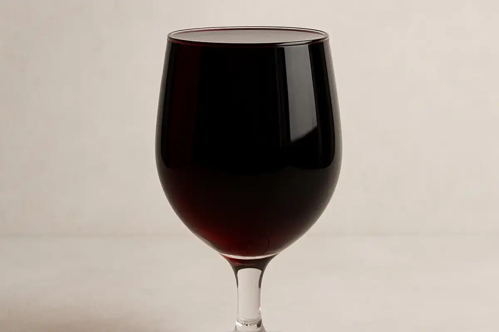

# Milestone 1

## OOD Image Generation Tasks

## Relevant Prompt Attribute

- **Core Quantitative Attributes**

  - word_count: total words

- **Semantic / Content-Based Attributes**
  - descriptor_words_count: adjectives + adverbs count
  - noun_count
  - verb_count
  - proper_noun_count
  - emotion_words (anger, joy, fear, etc.)
  - sensory_words_count (color terms, shape terms, texture terms)
  - object_count (unique nouns)
- **Syntactic Attributes**
  - sentence_count
  - avg_sentence_length
  - question_present (boolean)
  - command_present ("show", "generate", "make", etc.)
- **Stylistic Attributes**:
  - hedging_words_count ("maybe", "sort of", "somewhat")
  - intensifier words_count ("very", "extremely")
- **Image-Relevant Attributes**
  - num_visual_attributes (color words, size words)
  - num_actions ("jumping", "riding", "pouring")
- **LLM-Specific Attributes**
  - prompt_length_category (short / medium / long)
  - ambiguity_category (clear / partially ambiguous / fully ambiguous)

## Prompt Writing Guide

(Reference: https://docs.cloud.google.com/vertex-ai/generative-ai/docs/image/img-gen-prompt-guide)

- **Subject**: The first thing to think about with any prompt is the subject: the object, person, animal, or scenery you want an image of.
- **Context and background**: Just as important is the background or context in which the subject will be placed. Try placing your subject in a variety of backgrounds. For example, a studio with a white background, outdoors, or indoor environments.

- **Style**: Finally, add the style of image you want. Styles can be general (painting, photograph, sketches) or very specific (pastel painting, charcoal drawing, isometric 3D).

An example of the prompt generation template is:

```
 <subject>
with <visual_composition>
made of <material>
in a state where <object_state>
set against <context>
in a <style> style.
```

## Membership Inference Pipeline

Reference: Matyas Bohacek, Hany Farid; Proceedings of the IEEE/CVF International Conference on Computer Vision (ICCV) Workshops, 2025, pp. 321-330

This section summarizes the full pipeline used to perform membership inference on image-generation models. The goal is to determine whether a specific image was part of the model’s training data by analyzing how closely the model reconstructs it at varying noise strengths.

- 1. Load Required Packages and LPIPS Metric

We begin by loading LPIPS, a perceptual distance metric that approximates human image similarity by comparing deep VGG features instead of raw pixels.

```python
loss_fn = lpips.LPIPS(net='vgg').to("cuda")

to_tensor = T.Compose([
    T.Resize((256,256)),   # standardize resolution
    T.ToTensor()           # convert to PyTorch tensor
])

def lpips_dist(img1, img2):
    t1 = to_tensor(img1).unsqueeze(0).to("cuda")  # add batch dimension
    t2 = to_tensor(img2).unsqueeze(0).to("cuda")
    d = loss_fn(t1, t2)                           # perceptual distance
    return d.item()                               # convert tensor → float
```

- 2. Load Stable Diffusion Img2Img Pipeline

We use the img2img pipeline since it allows injecting noise into the seed image and observing how well the model reconstructs it.

```python
pipe = StableDiffusionImg2ImgPipeline.from_pretrained(
    "runwayml/stable-diffusion-v1-5",
    torch_dtype=torch.float16              # lower VRAM, faster inference
).to("cuda")                               # run all components on GPU

```

- 3. Load the Candidate Seed Image

This is the image we want to test for membership.


```python
seed = Image.open(seed_path).convert("RGB")
caption = "a glass bottle of wine filled to the brim"
seed
```

- 4. Generate Reconstructions at Multiple Strength Levels

Membership inference relies on the idea that training images tend to be reconstructed more faithfully, especially at low noise levels.

We define noise strengths and generate multiple samples per strength:

```python
strengths = [0.02, 0.2, 0.4, 0.6, 0.8, 1.0]
num_samples = 4

all_outputs = {s: [] for s in strengths}

for s in strengths:
    print(f"Generating for strength = {s}")
    for _ in range(num_samples):
        img = pipe(
            prompt=caption,
            image=seed,
            strength=s,              # how much noise to apply
            guidance_scale=7.5,       # prompt adherence
            num_inference_steps=50
        ).images[0]

        all_outputs[s].append(img)

```

- 5. Compute LPIPS Distances for Each Strength

For each noise level, we compute perceptual similarity between the seed and generated images. We use the minimum LPIPS distance per strength, because the closest reconstruction is most indicative of membership inference.

```python
feature_vector = []

for s in strengths:
    print(f"Computing LPIPS at strength = {s}")
    dists = [lpips_dist(seed, img) for img in all_outputs[s]]
    feature_vector.append(min(dists))

print("\nFeature vector:", feature_vector)

```

- 6. Feature Vector Interpretation

The resulting vector:

[LPIPS_strength_0.02,
LPIPS_strength_0.2,
LPIPS_strength_0.4,
LPIPS_strength_0.6,
LPIPS_strength_0.8,
LPIPS_strength_1.0]

Forms the membership signature.

    - If the image was in training:

        Low strength → very small LPIPS (model reconstructs it well).

        Higher strength → values increase smoothly.

    - If the image was not in training:

        LPIPS stays relatively high.

        No dramatic drop at low strength.

This feature vector can then be fed into either a logistic regression classifier or a threshold-based rule for membership inference. We used a threshold-based rule that if the LIPIS is smaller than 0.25 when strength is 1, then the image is likely to be in-training. If not, then it is likely out-of-training.

The result feature vector of the wine bottle example is:
Feature vector: [0.03773997351527214, 0.0715467557311058, 0.19348135590553284, 0.17256315052509308, 0.18868671357631683, 0.32252246141433716], where we look at the last feature. We conclude (with the threshold of 0.25) that the image is out of training and is good for the target image of an ood task.

## VQAScore Working Example

### Real Image Examples and Score

- **Image generation prompt**: "A glass of red wine that is filled completely to the brim with wine."

### Prompt List

- "an empty deodorant stick"

- "a book without a cover"

- "a pencil sharpened all the way to the eraser clasp"

- "a fork missing one or two prongs but still usable"

## Image Outputs

### VQAScore Comparisons

- Wineglass Task: full vs. half glass scores on VQAScore
  - All images from google images
- Measurement prompt: a glass of red wine that is filled completely to the brim.
  ensor([[0.5448],
        [0.7288],
        [0.6974],
        [0.5737],
        [0.5754],
        [0.7126],
        [0.6381],
        [0.6501],
        [0.6270],
        [0.6603]], device='cuda:0')

[Full 1](images/wine/full_0001.png)

- clip-flant5-xxl: 0.5833
- llava-v1.5-13b: 0.5448

[Full 2](images/wine/full_0002.png)

- clip-flant5-xxl: 0.8114
- llava-v1.5-13b: 0.7288

[Full 3](images/wine/full_0003.png)

- clip-flant5-xxl: 0.7980
- llava-v1.5-13b: 0.6974

[Full 4](images/wine/full_0004.png)

- clip-flant5-xxl: 0.6258
- llava-v1.5-13b: 0.5737

[Full 5](images/wine/full_0005.png)

- clip-flant5-xxl: 0.7446
- llava-v1.5-13b: 0.5754

#### **Full glass overall stats**

- clip-flant5-xxl: e
- llava-v1.5-13b:

[Half 1](images/wine/half_0001.png)

- clip-flant5-xxl: 0.6444
- llava-v1.5-13b: 0.7126

[Half 2](images/wine/half_0002.png)

- clip-flant5-xxl: 0.5249
- llava-v1.5-13b: 0.6381

[Half 3](images/wine/half_0003.png)

- clip-flant5-xxl: 0.6444
- llava-v1.5-13b: 0.6501

[Half 4](images/wine/half_0004.png)

- clip-flant5-xxl: 0.5127
- llava-v1.5-13b: 0.6270

[Half 5](images/wine/half_0005.png)

- clip-flant5-xxl: 0.6846
- llava-v1.5-13b: 0.6603

#### **Half glass overall stats**

- clip-flant5-xxl:
- llava-v1.5-13b:

## Prompt Enrichment Example

- "Generate a glass of deep red wine filled completely to the brim, shown at an eye-level camera angle with product-shot framing and a shallow depth of field. The wine is held in a clear glass with visible surface tension at the brim. Place the glass on a matte black surface against a dark gradient background, rendered in a high-contrast photorealistic style."
